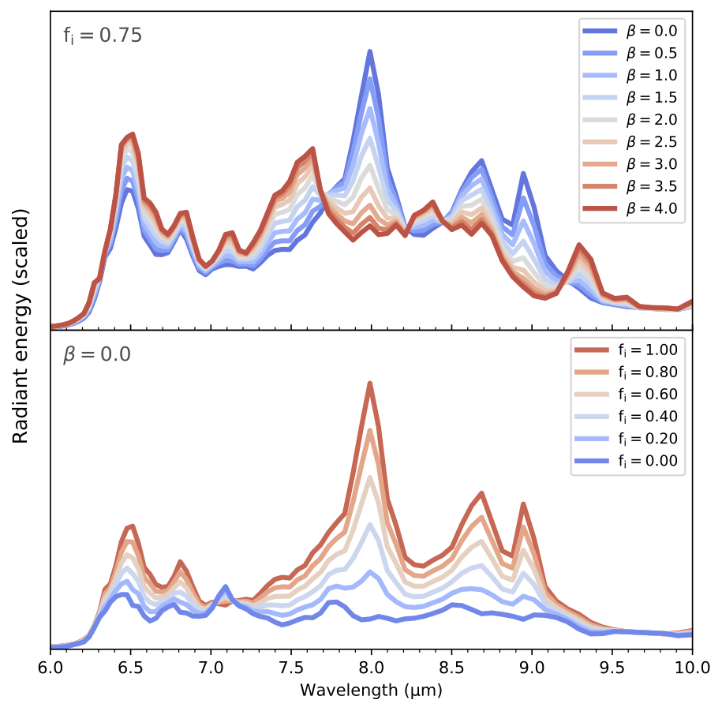
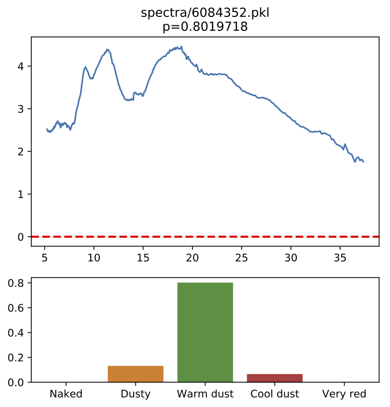
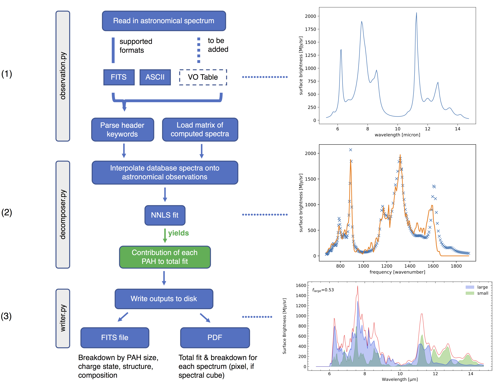
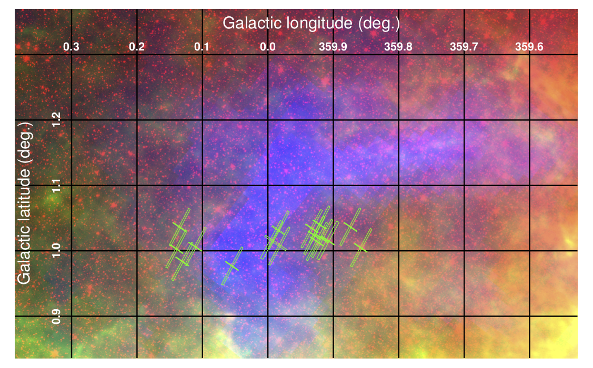
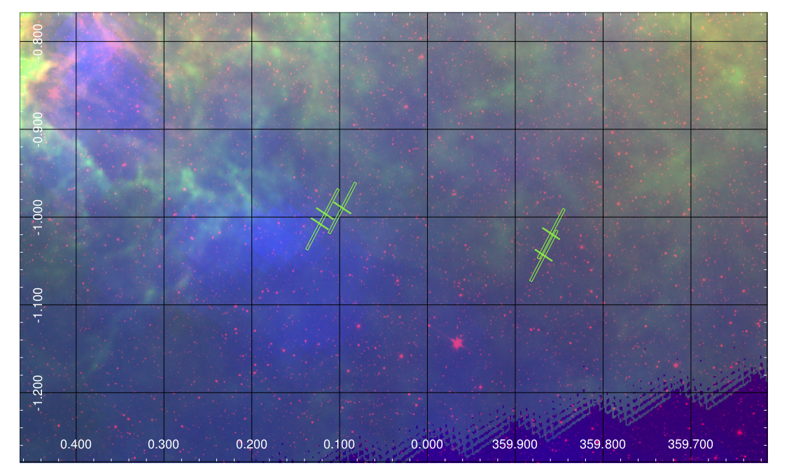
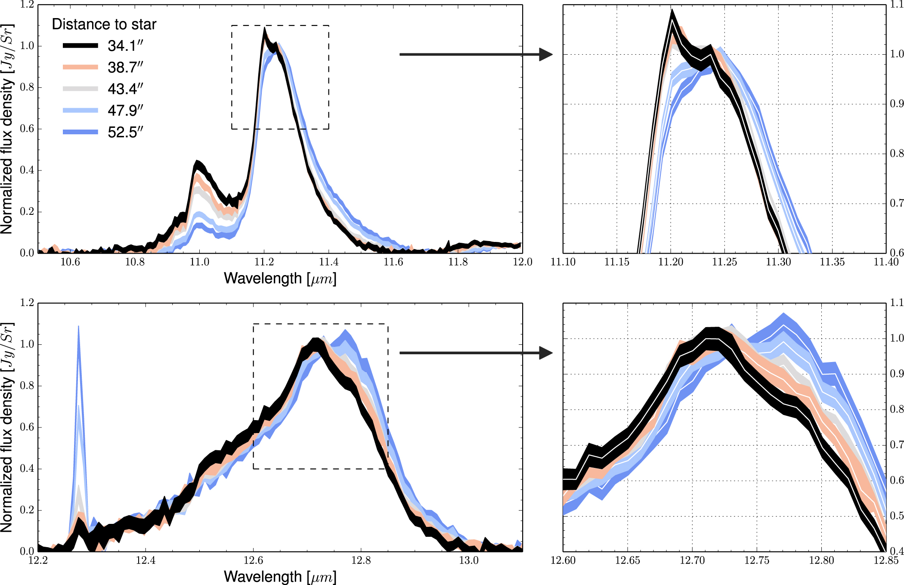
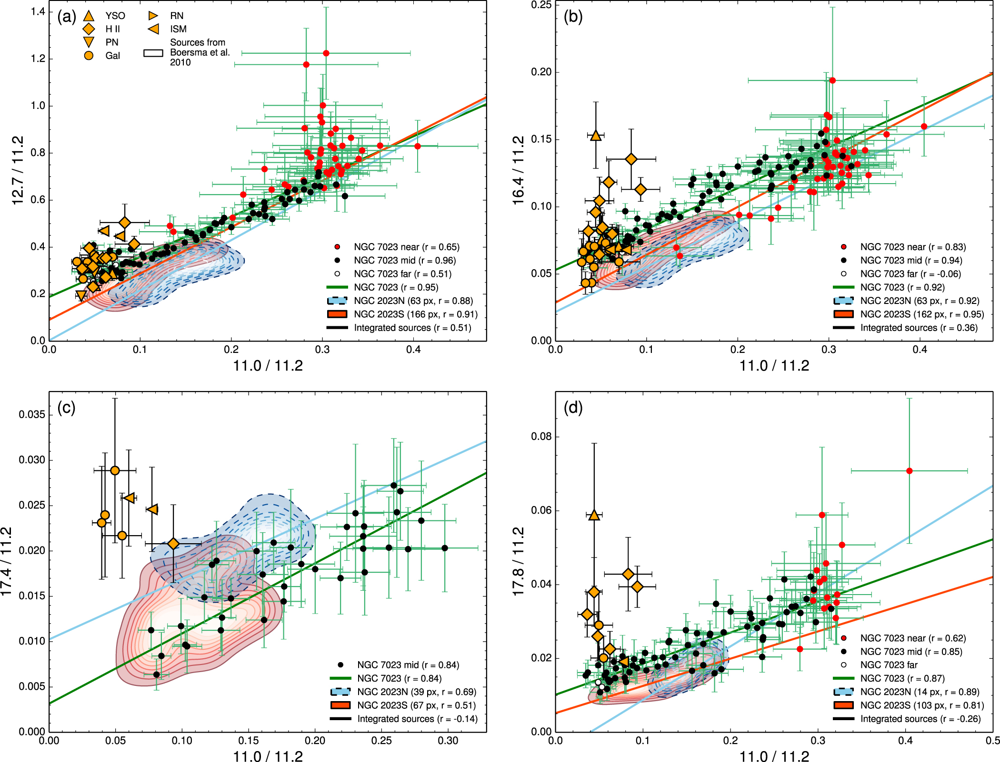

1. [Using the NASA Ames molecular database to study organic molecules [2019]](#proj00)
2. [Neural networks and astronomical datasets [2018+]](#proj01)
3. [A database-driven Python tool for astronomers [2017+]](#proj02)
4. [PAH emission from the Galactic Bulge [2017]](#proj03)
5. [Hyperspectral imaging for studying organic molecules in space [2016]](#proj04)
6. [New statistical relationships for organic molecules [2015]](#proj05)

---
***
##  Creating synthetic spectra using the NASA Ames molecular database and implications therein
2017 – 2019, __[http://adsabs.harvard.edu/abs/2018arXiv181202178S](http://adsabs.harvard.edu/abs/2018arXiv181202178S)__

<figure style="border: 1px solid #000; color:blue; display:table; background-color:#fff; padding:5px; font-size:.875em; margin:auto;">
    
    <figcaption style="display:table-caption; caption-side:bottom; background:#000; padding:0 5px 5px; line-height: 1.2">Ways in which synthetic spectra can be created by using the NASA Ames PAH IR Specotrscopic Database (<a href="https://www.astrochemistry.org/pahdb">www.astrochemistry.org/pahdb</a>). We use these data to investigate how molecule charge, size, composition and structure affect the emerging emission spectrum that we see in space.</figcaption>
</figure>

We present insights into the behavior of the astronomical 7.7 μm polycyclic aromatic hydrocarbon (PAH) emission complex as gleaned from analyzing synthesized spectra, utilizing the data and tools from the NASA Ames PAH IR Spectroscopic Database. We specifically study the influence of PAH size, charge, aliphatic content and nitrogen substitution on the profile and peak position of the 7.7 μm feature (λ7.7). The 7.7 μm band is known to vary significantly from object-to-object in astronomical observations, but the origin of these variations remains highly speculative. Our results indicate that PAH size can accommodate the largest shift in λ7.7 (~0.4 μm), where relatively small PAHs are consistent with class A spectra (fewer than 60 carbon atoms) while large PAHs are consistent with red/very red class B spectra. Aliphatic PAHs, of which our sample only contains a few, can produce redshifts typically around 0.15 μm; changes in ionization fraction, depending on the species, produce shifts up to 0.1 μm; and nitrogen substitution has no effect on λ7.7. Within the limits of our study, the class B-to-A transition is best explained with a changing PAH size distribution, with a relatively minor role assigned to aliphatic content and varying charge states. The resulting astronomical picture is that the photochemical evolution of PAHs moving from shielded class C/B environments into exposed ISM-like class A environments may be intrinsically different from the reverse class A-to-B transition of interstellar PAHs being incorporated into newly-forming star systems.

##  Applying neural networks and other machine learning methods to astronomical datasets
2018 – Present, __[https://github.com/mattjshannon/swsnet](https://github.com/mattjshannon/swsnet)__

<figure style="border: 1px solid #000; color:blue; display:table; background-color:#fff; padding:5px; font-size:.875em; margin:auto;">
    
    <figcaption style="display:table-caption; caption-side:bottom; background:#000; padding:0 5px 5px; line-height: 1.2">By training a neural network on labelled astronomical data, we can make predictions as to the content of new spectroscopic observations, such as for the spetrum of IRAS 17304-1933, a variable star. It is dominated by warm dust.</figcaption>
</figure>

 The premise of this project is to utilize machine learning algorithms to extract useful predictive models to characterize astronomical observations: specifically, can we identify the type of star accurately by examining its mid-infrared emission spectrum alone? Features such as atomic/molecular emission lines, dust temperature, the presence of organics, and other spectral facets are compressed into the model representations. This project is open source and shared on GitHub.

I am utilizing the Tensorflow implementation of Keras to create neural networks in addition to various models of scikit-learn (e.g., logistic regression). We train and test on a 1239-source astronomical dataset of nearby stars, classified/labelled by Kraemer et al. 2002 (ApJS, 140, 389) and Sloan et al. 2003 (ApJ 147, 379). Upcoming steps in this analysis include the application of these models to the larger 6000+ spectral dataset of the Cornell Spitzer Atlas project (CASSIS; __[https://cassis.sirtf.com/](https://cassis.sirtf.com/)__).

***
##  pyPAHdb: a Python tool for analyzing organic molecules in astronomical spectra
2017 – Present, __[https://github.com/PAHdb/pyPAHdb](https://github.com/PAHdb/pyPAHdb)__

<figure style="border: 1px solid #000; color:blue; display:table; background-color:#fff; padding:5px; font-size:.875em; margin:auto;">
    
    <figcaption style="display:table-caption; caption-side:bottom; background:#000; padding:0 5px 5px; line-height: 1.2">The general structure of pyPAHdb. Using the strength of the NASA Ames PAH IR Spectroscopic Database (PAHdb; <a href="https://www.astrochemistry.org/pahdb">www.astrochemistry.org/pahdb</a>), astronomical spectra are decomposed to identify the predominant molecules that make up their emission bands.</figcaption>
</figure>

We present the software tool pyPAHdb to the scientific astronomical community, which is used to characterize emission from one of the most prevalent types of organic molecules in space, namely polycyclic aromatic hydrocarbons (PAHs). It leverages the detailed studies of organic molecules done at the NASA Ames Research Center. pyPAHdb is a streamlined Python version of the NASA Ames PAH IR Spectroscopic Database (PAHdb; <a href="https://www.astrochemistry.org/pahdb">www.astrochemistry.org/pahdb</a>) suite of IDL tools. PAHdb has been extensively used to analyze and interpret the PAH signature from a plethora of emission sources, ranging from solar-system objects to entire galaxies. pyPAHdb decomposes astronomical PAH emission spectra into contributing PAH sub-classes in terms of charge and size using a database-fitting technique. The inputs for the fit are spectra constructed using the spectroscopic libraries of PAHdb and take into account the detailed photo-physics of the PAH excitation/emission process.

***
##  The nature of hydrocarbon emission from the Galactic Bulge
2016 – 2017, __[http://adsabs.harvard.edu/abs/2018ApJ...855...32S](http://adsabs.harvard.edu/abs/2018ApJ...855...32S)__

<figure style="border: 1px solid #000; color:blue; display:table; background-color:#fff; padding:5px; font-size:.875em; margin:auto;">
    
    
    <figcaption style="display:table-caption; caption-side:bottom; background:#000; padding:0 5px 5px; line-height: 1.2">Emission zones above and below (top, bottom, respectively) the Galactic Plane.</figcaption>
</figure>

A scientific analysis of the infrared emission from polycyclic aromatic hydrocarbon molecules from the Galactic bulge region of our galaxy. These molecules are shock-heated and produce significant diffuse background emission near the plane of the galaxy. We show that we are probing an environment similar to the galactic wind of starburst galaxy M82.

***
##  Hyperspectral imaging for studying organic molecules in space
2015 – 2016, __[http://adsabs.harvard.edu/abs/2016ApJ...824..111S](http://adsabs.harvard.edu/abs/2016ApJ...824..111S)__

<figure style="border: 1px solid #000; color:blue; display:table; background-color:#fff; padding:5px; font-size:.875em; margin:auto;">
    
    <figcaption style="display:table-caption; caption-side:bottom; background:#000; padding:0 5px 5px; line-height: 1.2">In this study, we examine the subtle variations of two prominent emission bands (top, bottom) produced by organic molecules. Their emission is sensitive to their distance from the nearby bright star.</figcaption>
</figure>

We develop and apply a Gaussian-based decomposition technique to analyze infrared-band hyperspectral images (also known as spatial-spectral maps) of polycyclic aromatic hydrocarbon emission in our galaxy. With this technique, we are able to identify and distinguish between independent molecular populations that are otherwise hidden within spectroscopic blends. We utilize a combination of traditional molecular analysis techniques with an image comparison algorithm to characterize the hydrocarbon population(s). With these approaches, we are able to quantify the ionization fractions of emission bands heretofore unknown.

***
##  New statistical relationships amongst astronomical organic molecules
2013 – 2015, __[http://adsabs.harvard.edu/abs/2015ApJ...811..153S](http://adsabs.harvard.edu/abs/2015ApJ...811..153S)__

<figure style="border: 1px solid #000; color:blue; display:table; background-color:#fff; padding:5px; font-size:.875em; margin:auto;">
    
    <figcaption style="display:table-caption; caption-side:bottom; background:#000; padding:0 5px 5px; line-height: 1.2">Emission features (probed by the quantities on the X and Y axes) exhibit different behaviours across different environments (contours, coloured dots).</figcaption>
</figure>

We report new relationships between the 15-20 μm emission bands of polycyclic aromatic hydrocarbons (PAHs) in a sample of 57 sources observed with the Spitzer/Infrared Spectrograph. This sample includes Large Magellanic Cloud point sources from the SAGE-Spec survey, nearby galaxies from the Spitzer Infrared Nearby Galaxies Survey survey, two Galactic interstellar medium cirrus sources, and the spectral maps of the Galactic reflection nebulae NGC 2023 and NGC 7023. These results show new links between families of organic hydrocarbons, enhancing our understanding of molecule formation, evolution and destruction.
